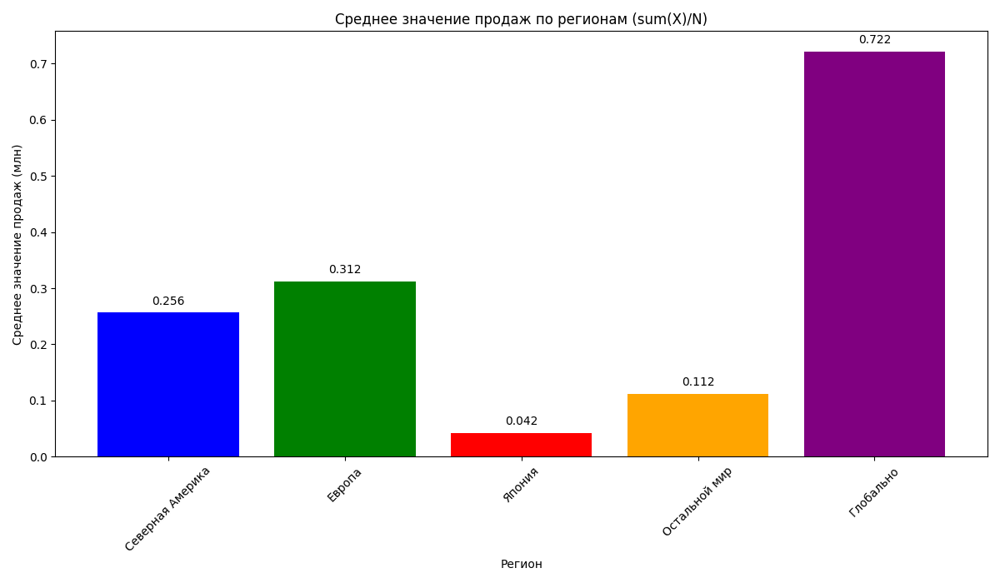
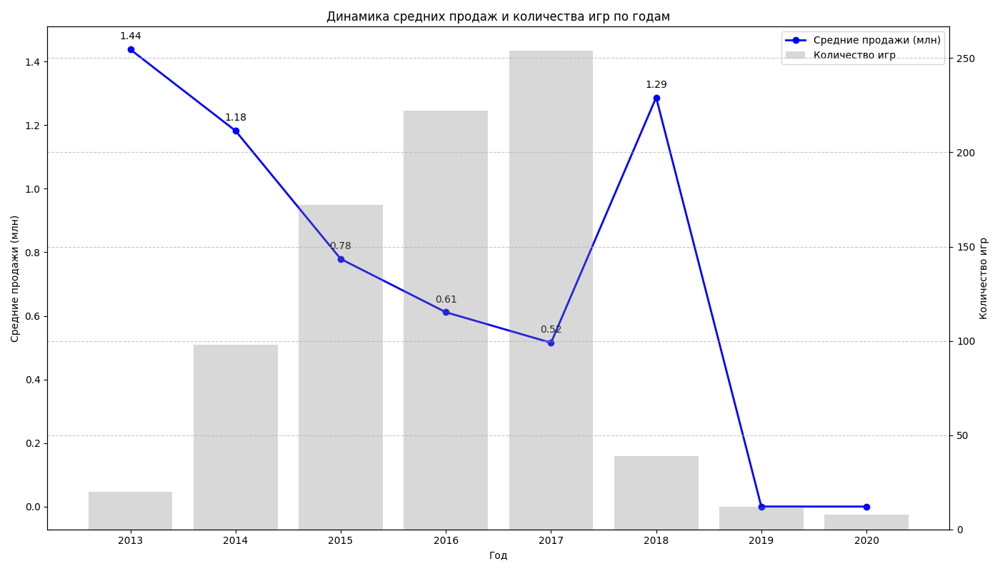

# 🎮 PlayStation 4 Games Sales Analysis


## 📊 About the Project

This project represents a comprehensive analysis of PlayStation 4 game sales. We explore:
- Regional sales differences
- Console lifecycle impact on sales
- Genre preferences across regions
- Sales trends by year

## 🚀 Features

- 📈 Data visualization with interactive graphs
- 🌍 Regional preferences analysis
- 📅 Temporal trends research
- 🎯 Key success factors identification

## 🛠️ Technologies

- Python 3.8+
- Pandas
- Matplotlib
- Seaborn
- Jupyter Notebook

## 📁 Project Structure

```
.
├── data/               # Data
│   ├── raw/           # Raw data
│   └── processed/     # Processed data
├── notebooks/         # Jupyter notebooks
├── reports/           # Reports and visualizations
├── src/               # Source code
│   ├── analysis/     # Analysis modules
│   ├── data/         # Data processing
│   └── visualization/# Visualization
└── tests/            # Tests
```

## 🚀 Getting Started

1. Clone the repository:
```bash
git clone https://github.com/rodya-basmanov/ps4-sales-analysis.git
cd ps4-sales-analysis
```

2. Install dependencies:
```bash
pip install -r requirements.txt
```

3. Run the analysis:
```bash
python run_analysis.py
```

## 📊 Visualization Examples

### Regional Sales


### Yearly Dynamics


## 📝 License

This project is distributed under the MIT License. See the [LICENSE](LICENSE) file for details.

## 📧 Contact

Rodion Basmanov - [st135699@student.spbu.ru](mailto:st135699@student.spbu.ru) 